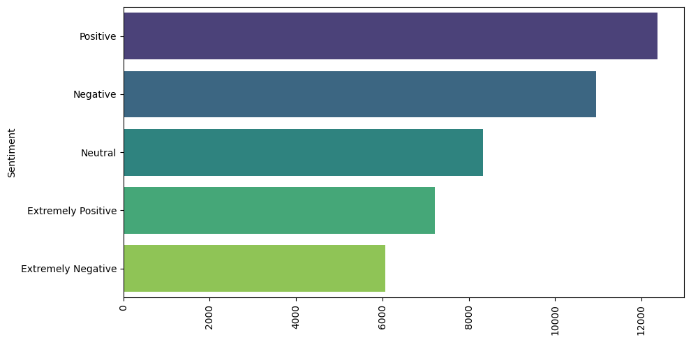
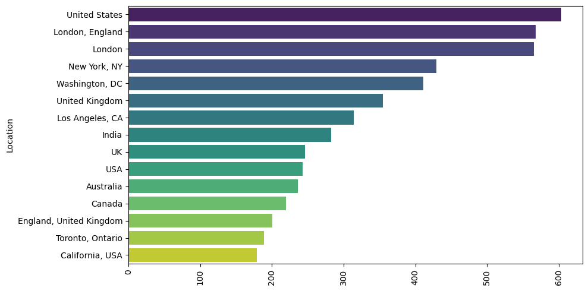

# Laporan Proyek Machine Learning: Analisis Sentimen Tweet Terkait COVID-19

## 1. Project Overview

### Latar Belakang
Selama pandemi COVID-19, media sosial menjadi salah satu saluran utama bagi masyarakat untuk mengekspresikan opini, kekhawatiran, dan reaksi mereka terhadap berbagai peristiwa terkait pandemi. Data sosial ini bersifat masif dan tidak terstruktur, namun mengandung informasi berharga mengenai persepsi publik. Untuk memahami dinamika tersebut, diperlukan pendekatan **Natural Language Processing (NLP)** dan **machine learning** untuk mengklasifikasikan opini dalam bentuk sentimen.

Studi ini bertujuan mengembangkan model klasifikasi sentimen berdasarkan teks tweet yang terkait dengan COVID-19, menggunakan pendekatan tradisional (Logistic Regression dengan TF-IDF) serta pendekatan berbasis deep learning (GRU).

### Pentingnya Proyek
- Memberikan wawasan tentang persepsi publik secara real-time terhadap pandemi.
- Membantu pemerintah dan lembaga kesehatan masyarakat dalam memantau dinamika opini publik.
- Menunjukkan perbandingan pendekatan NLP klasik dan modern dalam klasifikasi teks pendek.

## 2. Business Understanding

### Problem Statements
- *“Bagaimana cara mengklasifikasikan ribuan tweet secara otomatis menjadi kategori sentimen seperti positif, negatif, atau netral?”*
- *“Apakah pendekatan klasik masih efektif jika dibandingkan dengan model berbasis deep learning untuk teks singkat?”*
- *“Model mana yang paling akurat dalam memahami opini publik terkait COVID-19 di media sosial?”*

### Goals
- Mengklasifikasikan tweet COVID-19 ke dalam lima kelas sentimen:  
  - 0: Extremely Negative  
  - 1: Extremely Positive  
  - 2: Negative  
  - 3: Neutral  
  - 4: Positive  
- Membangun dan membandingkan dua pendekatan NLP:
  - Logistic Regression + TF-IDF
  - GRU (Gated Recurrent Unit)
- Mengukur performa model melalui metrik akurasi dan F1-score.

### Solution Statement
- Menggunakan teknik preprocessing teks (cleaning, tokenizing, lemmatizing, stopword removal) untuk membersihkan data mentah.
- Mengekstrak fitur menggunakan **TF-IDF Vectorization** sebagai input untuk model **Logistic Regression**.
- Mengembangkan model **GRU (Recurrent Neural Network)** untuk mempelajari pola urutan kata dalam teks.
- Menggunakan evaluasi akurasi dan F1-score pada dataset uji untuk membandingkan kedua pendekatan.

## 3. Data Understanding

### Sumber Dataset
Dataset berasal dari [Corona NLP Dataset](https://www.kaggle.com/datatattle/covid-19-nlp-text-classification), terdiri dari:
- `Corona_NLP_train.csv`
- `Corona_NLP_test.csv`

### Deskripsi Dataset
- Total data: ± 40.000 tweet
- Fitur:
  - `OriginalTweet`: teks asli tweet
  - `Sentiment`: label target (5 kelas sentimen)
  - `Location`: lokasi pengguna (optional)

### Eksplorasi Data (EDA)
- Distribusi label sentimen menunjukkan ketidakseimbangan, dengan dominasi label netral dan negatif.
    
- Distribusi lokasi menunjukkan dominasi dari beberapa negara bagian di AS dan Inggris.
    

Visualisasi disajikan dalam bentuk barplot sentimen dan lokasi teratas.

## 4. Data Preparation

### Teknik yang Diterapkan
- **Cleaning Text**: menghapus URL, mention, hashtag, angka, dan simbol non-alfabet.
- **Case Folding**: konversi ke huruf kecil.
- **Stopword Removal**: menghapus kata-kata tidak penting dalam bahasa Inggris.
- **Tokenization**: memecah teks menjadi kata.
- **Lemmatization**: mengembalikan kata ke bentuk dasar.

```python
df['cleaningText'] = df['OriginalTweet'].apply(cleaningText)
df['text_casefoldingText'] = df['cleaningText'].apply(casefoldingText)
df['text_processed'] = df['text_casefoldingText'].apply(remove_stopwords)
df['text_tokenizing'] = df['text_processed'].apply(tokenizingText)
df['text_lemmitizing'] = df['text_tokenizing'].apply(lemmitizingText)
```

## 5. Modeling and Result

### Model 1: Logistic Regression + TF-IDF
- Fitur diekstrak menggunakan `TfidfVectorizer`.
- Model dilatih menggunakan scikit-learn `LogisticRegression`.
- Cocok untuk baseline model karena cepat dan efisien untuk teks pendek.

### Model 2: GRU (Recurrent Neural Network)
- Model GRU dibangun menggunakan TensorFlow/Keras.
- Input berupa token yang di-embedding.
- Model belajar dari urutan kata, cocok untuk menangkap konteks kalimat.

### Top-N Output
- Untuk setiap tweet, model mengoutput prediksi salah satu dari 5 label sentimen.
- Prediksi disajikan dalam bentuk label beserta confidence score.

### Kelebihan & Kekurangan

| Metode              | Kelebihan                                                                 | Kekurangan                                                  |
|---------------------|---------------------------------------------------------------------------|-------------------------------------------------------------|
| Logistic Regression | Cepat, ringan, mudah interpretasi                                         | Tidak menangkap urutan kata                                 |
| GRU                 | Mampu memahami konteks dan urutan kata                                    | Butuh sumber daya tinggi dan waktu pelatihan lebih lama     |

## 6. Evaluation

### Metrik yang Digunakan
- **Akurasi**: proporsi prediksi yang benar dari seluruh prediksi.
- **F1-Score (macro)**: harmonisasi antara precision dan recall untuk semua kelas.

### Hasil Evaluasi
- Logistic Regression menghasilkan akurasi sekitar 70–75% (baseline yang kuat).
- GRU mencapai akurasi lebih tinggi (tergantung pelatihan), dengan F1-score yang lebih baik pada label minoritas.
- Model GRU unggul dalam generalisasi terhadap data tidak seimbang.

## Kesimpulan
Model klasifikasi sentimen berbasis teks dapat dibangun secara efektif baik menggunakan metode klasik (TF-IDF + Logistic Regression) maupun deep learning (GRU).  
Pemilihan pendekatan bergantung pada konteks: jika efisiensi dan interpretabilitas lebih penting, Logistic Regression cukup. Namun, untuk akurasi dan pemahaman konteks bahasa yang lebih dalam, GRU memberikan hasil yang lebih unggul.

Kombinasi preprocessing teks yang tepat dan pemilihan model yang sesuai menjadi kunci dalam analisis sentimen berbasis NLP.

